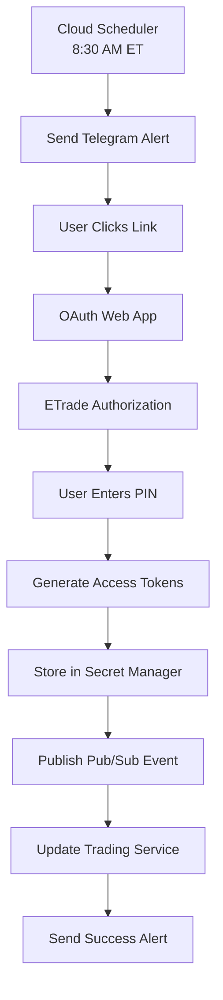

# Alert System Documentation
## V2 ETrade Strategy - Comprehensive Alert Management

**Last Updated**: September 15, 2025  
**Version**: 2.0  
**Purpose**: Complete documentation of the alert system including Telegram notifications, OAuth alerts, trade signals, and end-of-day reports.

---

## 📋 **Table of Contents**

1. [Alert System Overview](#alert-system-overview)
2. [Telegram Integration](#telegram-integration)
3. [OAuth Token Alerts](#oauth-token-alerts)
4. [Trade Signal Alerts](#trade-signal-alerts)
5. [End-of-Day Trade Reports](#end-of-day-trade-reports)
6. [Alert Configuration](#alert-configuration)
7. [Alert Types and Levels](#alert-types-and-levels)
8. [Integration with Trading System](#integration-with-trading-system)
9. [Troubleshooting](#troubleshooting)
10. [API Reference](#api-reference)

---

## 🚨 **Alert System Overview**

The V2 ETrade Strategy implements a comprehensive alert system that provides real-time notifications for:

- **OAuth Token Management**: Daily renewal reminders and status updates
- **Trade Signals**: Entry/exit notifications with detailed trade information
- **Performance Monitoring**: Real-time P&L updates and system status
- **End-of-Day Summaries**: Comprehensive daily trading reports
- **System Alerts**: Error notifications and system health updates

### Key Features

- **Multi-Channel Delivery**: Telegram, email, and webhook support
- **Intelligent Throttling**: Prevents alert spam while maintaining critical notifications
- **Rich Formatting**: Emoji-enhanced messages with structured data
- **Priority Levels**: Critical, warning, info, and success classifications
- **Historical Tracking**: Complete alert history and analytics

---

## 📱 **Telegram Integration**

### Setup Requirements

1. **Bot Token**: Create a Telegram bot via @BotFather
2. **Chat ID**: Obtain your personal chat ID or channel ID
3. **Environment Variables**:
   ```env
   TELEGRAM_BOT_TOKEN=your_bot_token_here
   TELEGRAM_CHAT_ID=your_chat_id_here
   ```

### Bot Configuration

```python
# Example bot setup
BOT_TOKEN = "1234567890:ABCdefGHIjklMNOpqrsTUVwxyz"
CHAT_ID = "-1001234567890"  # For channels, use negative ID
```

### Message Formatting

The alert system uses rich formatting for better readability:

```python
# Trade Signal Example
message = f"""
🚀 **TRADE SIGNAL** 🚀
📊 Symbol: {symbol}
📈 Action: {action}
💰 Price: ${price:.2f}
📦 Quantity: {quantity}
🎯 Confidence: {confidence:.1%}
📊 Expected Return: {expected_return:.1%}
⏰ Time: {timestamp}
"""

# OAuth Alert Example
message = f"""
🔐 **OAUTH TOKEN RENEWAL**
⏰ Time: {datetime.now().strftime('%H:%M ET')}
🔗 Link: {oauth_url}
📱 Mobile-friendly interface ready
```

---

## 🔐 **OAuth Token Alerts**

### Daily Renewal Process

The OAuth alert system ensures continuous trading capability by managing token renewal:

#### 1. Morning Alert (8:30 AM ET)
- **Trigger**: Cloud Scheduler cron job
- **Purpose**: Remind user to renew tokens before market open
- **Message**: Includes direct link to OAuth renewal page
- **Mobile Optimized**: One-tap access to renewal process

#### 2. Token Status Alerts
- **Success**: Confirmation when tokens are successfully renewed
- **Warning**: Alerts when tokens are expiring soon (1 hour remaining)
- **Error**: Notifications for failed renewal attempts

#### 3. Integration Alerts
- **Secret Manager**: Confirmation when tokens are stored securely
- **Pub/Sub**: Notification when trading service is updated
- **Trading Service**: Confirmation of hot-reload success

### OAuth Alert Flow



### Alert Examples

#### Morning Renewal Alert
```
🌅 Good morning! It's Monday, Sep 15.

🔐 E*TRADE Token Renewal Required
⏰ Market opens in 1 hour

🔗 Production: https://etrade-auth.yourdomain.com/oauth/start?env=prod
🔗 Sandbox: https://etrade-auth.yourdomain.com/oauth/start?env=sandbox

📱 Tap, approve, paste PIN → Done
```

#### Token Renewal Success
```
✅ OAuth Token Renewed Successfully

🔐 Environment: Production
⏰ Time: 08:45 AM ET
🔄 Trading service updated
📊 Ready for market open

🎯 Next renewal: Tomorrow 8:30 AM ET
```

---

## 📊 **Trade Signal Alerts**

### Signal Types

#### 1. Entry Signals
- **BUY Signals**: New long position opportunities
- **SELL Signals**: New short position opportunities
- **Confidence Levels**: High, Medium, Low confidence indicators
- **Strategy Attribution**: Which strategy generated the signal

#### 2. Exit Signals
- **Take Profit**: Target reached, position closed
- **Stop Loss**: Risk limit hit, position closed
- **Trailing Stop**: Dynamic stop triggered
- **Time-based Exit**: Position closed due to time rules

#### 3. Position Updates
- **Size Adjustments**: Position sizing changes
- **Stop Updates**: Stop loss modifications
- **Target Updates**: Take profit adjustments

### Signal Alert Format

```python
# Entry Signal
entry_alert = f"""
🚀 **NEW TRADE SIGNAL** 🚀

📊 Symbol: {symbol}
📈 Action: {action}
💰 Entry Price: ${price:.2f}
📦 Quantity: {quantity}
🎯 Confidence: {confidence:.1%}
📊 Expected Return: {expected_return:.1%}
🛡️ Stop Loss: ${stop_loss:.2f}
🎯 Take Profit: ${take_profit:.2f}
📋 Strategy: {strategy}
⏰ Time: {timestamp}

💡 Reason: {reason}
"""

# Exit Signal
exit_alert = f"""
📤 **POSITION CLOSED** 📤

📊 Symbol: {symbol}
📈 Action: {action}
💰 Exit Price: ${price:.2f}
📦 Quantity: {quantity}
💵 P&L: ${pnl:.2f} ({pnl_pct:.1%})
📋 Strategy: {strategy}
⏰ Time: {timestamp}

💡 Reason: {reason}
"""
```

---

## 📈 **End-of-Day Trade Reports**

### Daily Summary Components

#### 1. Performance Metrics
- **Total Trades**: Number of trades executed
- **Win Rate**: Percentage of profitable trades
- **Total P&L**: Net profit/loss for the day
- **Best Trade**: Highest profit trade
- **Worst Trade**: Largest loss trade

#### 2. Strategy Performance
- **Strategy Breakdown**: Performance by strategy type
- **Signal Quality**: Average confidence scores
- **Execution Efficiency**: Fill rates and slippage

#### 3. Risk Metrics
- **Max Drawdown**: Largest peak-to-trough decline
- **Risk-Adjusted Returns**: Sharpe ratio and similar metrics
- **Position Sizing**: Average position sizes

#### 4. System Health
- **API Status**: ETrade API health
- **Data Quality**: Market data accuracy
- **Alert Status**: Notification system health

### End-of-Day Report Format

```python
eod_report = f"""
📊 **END OF DAY REPORT** 📊
📅 Date: {date.strftime('%A, %B %d, %Y')}

💰 **PERFORMANCE SUMMARY**
📈 Total Trades: {total_trades}
🎯 Win Rate: {win_rate:.1%}
💵 Total P&L: ${total_pnl:.2f}
📊 Daily Return: {daily_return:.2%}
🏆 Best Trade: ${best_trade:.2f}
📉 Worst Trade: ${worst_trade:.2f}

📋 **STRATEGY BREAKDOWN**
{strategy_breakdown}

🛡️ **RISK METRICS**
📉 Max Drawdown: {max_drawdown:.2%}
⚖️ Risk-Adjusted Return: {risk_adjusted_return:.2f}
📊 Average Position Size: ${avg_position_size:.2f}

🔧 **SYSTEM STATUS**
✅ ETrade API: {etrade_status}
✅ Data Feed: {data_status}
✅ Alerts: {alert_status}

⏰ Report Generated: {timestamp}
"""
```

---

## ⚙️ **Alert Configuration**

### Environment Variables

```env
# Telegram Configuration
TELEGRAM_BOT_TOKEN=your_bot_token
TELEGRAM_CHAT_ID=your_chat_id

# Alert Settings
ALERT_ENABLED=true
ALERT_THROTTLE_SECONDS=60
ALERT_MAX_PER_HOUR=50

# OAuth Alerts
OAUTH_ALERT_ENABLED=true
OAUTH_RENEWAL_HOUR=8
OAUTH_RENEWAL_MINUTE=30

# Trade Alerts
TRADE_ALERT_ENABLED=true
TRADE_CONFIDENCE_THRESHOLD=0.7
TRADE_MIN_SIZE=100

# EOD Reports
EOD_REPORT_ENABLED=true
EOD_REPORT_TIME=16:00
EOD_REPORT_TIMEZONE=America/New_York
```

### Alert Manager Configuration

```python
# Alert Manager Settings
alert_config = {
    "telegram": {
        "enabled": True,
        "bot_token": os.getenv("TELEGRAM_BOT_TOKEN"),
        "chat_id": os.getenv("TELEGRAM_CHAT_ID"),
        "throttle_seconds": 60,
        "max_per_hour": 50
    },
    "oauth": {
        "enabled": True,
        "morning_alert_time": "08:30",
        "timezone": "America/New_York",
        "renewal_url": os.getenv("OAUTH_RENEWAL_URL")
    },
    "trading": {
        "enabled": True,
        "confidence_threshold": 0.7,
        "min_position_size": 100,
        "include_metadata": True
    },
    "eod": {
        "enabled": True,
        "report_time": "16:00",
        "timezone": "America/New_York",
        "include_charts": True
    }
}
```

---

## 🎯 **Alert Types and Levels**

### Alert Levels

| Level | Description | Usage | Example |
|-------|-------------|-------|---------|
| `CRITICAL` | System failure, immediate action required | OAuth token expired, API down | 🔴 **CRITICAL: OAuth token expired** |
| `ERROR` | Error condition, investigation needed | Failed trade execution, data error | ⚠️ **ERROR: Trade execution failed** |
| `WARNING` | Potential issue, monitoring required | Low confidence signal, high risk | ⚠️ **WARNING: Low confidence signal** |
| `INFO` | Informational message | Trade executed, position updated | ℹ️ **INFO: Position opened** |
| `SUCCESS` | Successful operation | Token renewed, trade profitable | ✅ **SUCCESS: Token renewed** |

### Alert Types

| Type | Description | Frequency | Priority |
|------|-------------|-----------|----------|
| `OAUTH_RENEWAL` | Daily token renewal reminder | Daily 8:30 AM | High |
| `OAUTH_SUCCESS` | Token renewal confirmation | As needed | Medium |
| `OAUTH_ERROR` | Token renewal failure | As needed | Critical |
| `OAUTH_WARNING` | Token status warning | As needed | Medium |
| `TRADE_ENTRY` | New trade signal | Variable | High |
| `TRADE_EXIT` | Position closed | Variable | High |
| `PERFORMANCE_UPDATE` | P&L update | Every trade | Medium |
| `EOD_SUMMARY` | End-of-day report | Daily 4:00 PM | Medium |
| `SYSTEM_STATUS` | System health update | Hourly | Low |
| `ERROR_ALERT` | System error | As needed | Critical |

---

## 🔗 **Integration with Trading System**

### OAuth Integration Flow

```python
# OAuth Alert Integration
class OAuthAlertIntegration:
    def __init__(self, alert_manager, oauth_manager):
        self.alert_manager = alert_manager
        self.oauth_manager = oauth_manager
    
    async def send_morning_alert(self):
        """Send daily OAuth renewal reminder"""
        message = self._format_morning_alert()
        await self.alert_manager.send_alert(
            AlertType.OAUTH_RENEWAL,
            AlertLevel.INFO,
            "OAuth Token Renewal",
            message
        )
    
    async def send_renewal_success(self, environment):
        """Send token renewal success notification"""
        message = self._format_success_alert(environment)
        await self.alert_manager.send_alert(
            AlertType.OAUTH_SUCCESS,
            AlertLevel.SUCCESS,
            "Token Renewed",
            message
        )
```

### Trading System Integration

```python
# Trading Alert Integration
class TradingAlertIntegration:
    def __init__(self, alert_manager, trade_manager):
        self.alert_manager = alert_manager
        self.trade_manager = trade_manager
    
    async def send_trade_signal(self, signal):
        """Send trade signal alert"""
        if signal.confidence >= self.confidence_threshold:
            message = self._format_trade_signal(signal)
            await self.alert_manager.send_alert(
                AlertType.TRADE_ENTRY,
                AlertLevel.INFO,
                f"Trade Signal: {signal.symbol}",
                message
            )
    
    async def send_position_update(self, position):
        """Send position update alert"""
        message = self._format_position_update(position)
        await self.alert_manager.send_alert(
            AlertType.PERFORMANCE_UPDATE,
            AlertLevel.INFO,
            f"Position Update: {position.symbol}",
            message
        )
```

---

## 🔧 **Troubleshooting**

### Common Issues

#### 1. Telegram Notifications Not Working
**Symptoms**: No alerts received via Telegram
**Solutions**:
- Verify `TELEGRAM_BOT_TOKEN` is correct
- Check `TELEGRAM_CHAT_ID` format
- Ensure bot is not blocked
- Test with `/start` command

#### 2. OAuth Alerts Not Triggering
**Symptoms**: No morning renewal alerts
**Solutions**:
- Check Cloud Scheduler configuration
- Verify cron job is enabled
- Check timezone settings
- Review Cloud Run logs

#### 3. Alert Throttling Issues
**Symptoms**: Alerts being suppressed
**Solutions**:
- Adjust `ALERT_THROTTLE_SECONDS`
- Increase `ALERT_MAX_PER_HOUR`
- Check for duplicate alert conditions

#### 4. Message Formatting Issues
**Symptoms**: Malformed or incomplete messages
**Solutions**:
- Check emoji encoding
- Verify string formatting
- Review message length limits
- Test with simple messages first

### Debug Commands

```python
# Test alert system
await alert_manager.test_alert()

# Check configuration
alert_manager.print_config()

# View alert history
alert_manager.get_alert_history(limit=10)

# Test specific alert type
await alert_manager.send_test_alert(AlertType.OAUTH_RENEWAL)
```

---

## 📚 **API Reference**

### PrimeAlertManager Class

```python
class PrimeAlertManager:
    def __init__(self, config: Dict[str, Any] = None):
        """Initialize alert manager with configuration"""
    
    async def send_alert(self, alert_type: AlertType, level: AlertLevel, 
                        title: str, message: str, **kwargs):
        """Send alert with specified type and level"""
    
    async def send_trade_alert(self, trade_alert: TradeAlert):
        """Send trade-specific alert"""
    
    async def send_performance_update(self, performance: PerformanceSummary):
        """Send performance update alert"""
    
    async def send_eod_report(self, report: EODReport):
        """Send end-of-day report"""
    
    # OAuth-specific methods
    async def send_oauth_morning_alert(self) -> bool:
        """Send daily OAuth token renewal reminder"""
    
    async def send_oauth_renewal_success(self, environment: str) -> bool:
        """Send OAuth token renewal success notification"""
    
    async def send_oauth_renewal_error(self, environment: str, error_message: str) -> bool:
        """Send OAuth token renewal error notification"""
    
    async def send_oauth_warning(self, environment: str, warning_message: str) -> bool:
        """Send OAuth token warning notification"""
    
    def get_alert_history(self, limit: int = 100) -> List[Alert]:
        """Get recent alert history"""
    
    def print_config(self):
        """Print current configuration"""
```

### Alert Data Structures

```python
@dataclass
class Alert:
    alert_id: str
    alert_type: AlertType
    level: AlertLevel
    title: str
    message: str
    symbol: Optional[str] = None
    strategy: Optional[str] = None
    confidence: Optional[float] = None
    expected_return: Optional[float] = None
    timestamp: datetime = field(default_factory=datetime.now)
    metadata: Dict[str, Any] = field(default_factory=dict)

@dataclass
class TradeAlert:
    symbol: str
    strategy: str
    action: str  # "BUY" or "SELL"
    price: float
    quantity: int
    confidence: float
    expected_return: float
    stop_loss: Optional[float] = None
    take_profit: Optional[float] = None
    reason: str = ""
    timestamp: datetime = field(default_factory=datetime.now)

@dataclass
class OAuthAlert:
    environment: str  # "prod" or "sandbox"
    alert_type: str  # "renewal", "success", "error", "warning"
    message: str
    oauth_url: Optional[str] = None
    timestamp: datetime = field(default_factory=datetime.now)
    metadata: Dict[str, Any] = field(default_factory=dict)
```

---

## 🚀 **Getting Started**

### Quick Setup

1. **Configure Telegram Bot**:
   ```bash
   # Set environment variables
   export TELEGRAM_BOT_TOKEN="your_bot_token"
   export TELEGRAM_CHAT_ID="your_chat_id"
   ```

2. **Initialize Alert Manager**:
   ```python
   from modules.prime_alert_manager import PrimeAlertManager
   
   alert_manager = PrimeAlertManager()
   await alert_manager.initialize()
   ```

3. **Send Test Alert**:
   ```python
   await alert_manager.send_alert(
       AlertType.SYSTEM_STATUS,
       AlertLevel.INFO,
       "System Started",
       "Alert system is now active"
   )
   ```

4. **Configure OAuth Alerts**:
   ```python
   # Set up morning renewal alert
   await alert_manager.schedule_oauth_alerts()
   ```

### Integration Example

```python
# Complete integration example
import asyncio
from modules.prime_alert_manager import PrimeAlertManager, AlertType, AlertLevel

async def main():
    # Initialize alert manager
    alert_manager = PrimeAlertManager()
    await alert_manager.initialize()
    
    # Send OAuth renewal alert
    await alert_manager.send_alert(
        AlertType.OAUTH_RENEWAL,
        AlertLevel.INFO,
        "OAuth Token Renewal",
        "Please renew your E*TRADE tokens before market open"
    )
    
    # Send trade signal alert
    await alert_manager.send_trade_alert(TradeAlert(
        symbol="AAPL",
        strategy="Standard",
        action="BUY",
        price=150.25,
        quantity=100,
        confidence=0.85,
        expected_return=0.12
    ))

if __name__ == "__main__":
    asyncio.run(main())
```

---

## 📞 **Support**

For issues and questions regarding the alert system:

1. **Check Logs**: Review Cloud Run logs for error messages
2. **Test Configuration**: Use debug commands to verify setup
3. **Review Documentation**: Check this guide for common solutions
4. **Contact Support**: Reach out for advanced troubleshooting

---

**Last Updated**: September 15, 2025  
**Version**: 2.0  
**Maintainer**: V2 ETrade Strategy Team
