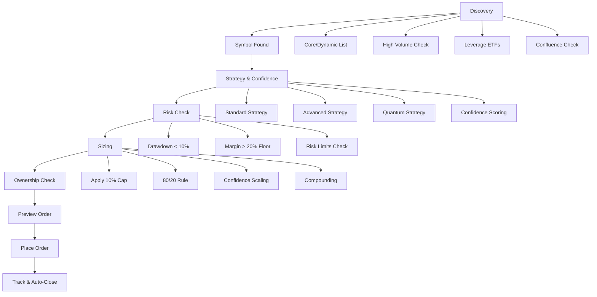

# 🛡️ Risk Management & Dynamic Position Sizing - Easy ETrade Strategy

## Overview

The Easy ETrade Strategy implements a sophisticated, multi-layered risk management system that ensures capital preservation while maximizing profit potential. The system never blindly opens trades — it runs through comprehensive checks to size dynamically, manage exposure, and preserve account health.

## 🔐 Core Principles of Risk Management

### 1. Margin & Balance Floors

#### **Default Capital Allocation Rule**
- **Use ~80% of account equity for trading** while reserving a **20% balance floor** as a safety buffer
- **Dynamic Balance Floor Growth**: As account equity grows, the absolute $ value of the 20% reserve grows too, so the bot's protection scales with profits
- **Margin Awareness**: Uses E*TRADE broker API accounts. Available margin is fetched via `getAccountBalances()` before opening a trade

#### **E*TRADE Cash Management Integration**
The system now uses E*TRADE's specific cash fields for precise capital management:

```python
# E*TRADE Cash Fields (Simplified)
etrade_balance = {
    'account_value': 50000.0,                    # Total account value
    'cash_available_for_investment': 10000.0,    # Primary trading cash
    'cash_buying_power': 20000.0,                # Total buying power (cash + margin)
    'option_level': 'Level 2'                    # Options trading level
}

# Capital Allocation Example
available_cash = 10000.0  # cash_available_for_investment
cash_reserve_pct = 20.0%  # $2,000 reserve
trading_cash_pct = 80.0%  # $8,000 for trading
```

#### **Cash Priority System**
1. **Primary**: `cash_available_for_investment` - Cash specifically for investments
2. **Secondary**: `cash_buying_power` - Total buying power including margin
3. **Fallback**: System gracefully handles missing data with conservative defaults

### 2. Trade Ownership Isolation

#### **The Easy ETrade Strategy Only Manages Its Own Positions**
- **Position Isolation**: Only manages positions it initiated
- **Manual Position Ignorance**: If the account already has manual positions or trades not placed by The Easy ETrade Strategy, these are ignored in sizing and exposure calculations
- **No Interference**: Prevents interference with manual trading or long-term investments in the same account

```python
# Position Filtering
strategy_positions = [pos for pos in all_positions if pos.bot_tag == "EES"]
manual_positions = [pos for pos in all_positions if pos.bot_tag != "EES"]
# Only use strategy_positions for sizing calculations
```

### 3. Risk Per Trade

#### **Hard Cap: Maximum Risk = 10% of Available Capital**
- **Base Risk Cap**: Maximum risk = 10% of available capital (not full account value)
- **Confidence Boosts**: High confidence trades (≥0.995) can unlock larger position sizing
- **Strategy-Specific Caps**:
  - **Standard Strategy**: 10% per trade (with confidence boosts)
  - **Advanced Strategy**: 10% per trade (with confidence boosts) 
  - **Quantum Strategy**: 10% per trade (with confidence boosts)

#### **Proportional Split Rule**
Risk is divided across all available trade candidates:

```python
# Example: 10 candidates with $1,000 available, 80% allowed → $80 each (8% of $1,000)
# Example: 20 candidates with $1,000 available, 80% allowed → $40 each (4% of $1,000)

available_cash = 1000
trading_cash = available_cash * 0.80  # $800
num_candidates = 10
risk_per_candidate = trading_cash / num_candidates  # $80 each
```

### 4. Dynamic Position Sizing with Boosting

#### **Base Position Sizing Framework**
- **Base Position Size**: 10% of available capital (cash + current positions)
- **Maximum Position Size**: 35% of available capital (after all boosts)
- **Available Capital**: Cash available + current ETrade Strategy positions (ignores manual positions)
- **80/20 Rule**: 80% for trading, 20% cash reserve
- **Position Splitting**: New positions split evenly from 80% available capital

#### **Position Size Boosting Scenarios**

**1. Confidence-Based Boosting**
```python
# Confidence Tiers for Position Sizing
if confidence >= 0.995:    # Ultra High Confidence
    confidence_multiplier = 1.5  # 50% boost
elif confidence >= 0.95:   # High Confidence  
    confidence_multiplier = 1.2  # 20% boost
elif confidence >= 0.90:   # Medium Confidence
    confidence_multiplier = 1.0  # No boost
else:                      # Low Confidence
    confidence_multiplier = 1.0  # No boost
```

**2. Strategy Agreement Boosting**
```python
# Strategy Agreement Bonuses for Position Sizing
agreement_bonuses = {
    'NONE': 0.0,      # 0 strategies agree
    'LOW': 0.0,       # 1 strategy agrees  
    'MEDIUM': 0.25,   # 2 strategies agree (+25%)
    'HIGH': 0.50,     # 3 strategies agree (+50%)
    'MAXIMUM': 1.00   # 4+ strategies agree (+100%)
}
```

**3. Profit-Based Scaling**
```python
# Profit Scaling Multipliers for Position Sizing
if profit_pct >= 2.0:      # 200%+ profit
    profit_multiplier = 1.8  # 80% boost
elif profit_pct >= 1.0:    # 100%+ profit  
    profit_multiplier = 1.4  # 40% boost
elif profit_pct >= 0.5:    # 50%+ profit
    profit_multiplier = 1.2  # 20% boost
elif profit_pct >= 0.25:   # 25%+ profit
    profit_multiplier = 1.1  # 10% boost
else:
    profit_multiplier = 1.0  # No boost
```

**4. Win Streak Boosting**
- **Consecutive Wins**: Gradual position size increases on win streaks
- **Streak Tracking**: Monitors consecutive wins and adjusts sizing accordingly
- **Implementation**: Framework ready for win streak tracking

#### **Position Sizing Algorithm with 80/20 Rule**
```python
def calculate_position_size_with_boosting(
    available_capital: float,
    signal_confidence: float,
    strategy_agreement_level: str,
    profit_percentage: float,
    win_streak: int,
    num_concurrent_positions: int
) -> float:
    # 1. Calculate 80% trading capital
    trading_capital = available_capital * 0.80
    
    # 2. Split trading capital evenly among concurrent positions
    base_position_value = trading_capital / max(1, num_concurrent_positions)
    
    # 3. Apply confidence multiplier
    confidence_multiplier = get_confidence_multiplier(signal_confidence)
    
    # 4. Apply strategy agreement bonus
    agreement_bonus = get_agreement_bonus(strategy_agreement_level)
    
    # 5. Apply profit-based scaling
    profit_multiplier = get_profit_scaling_multiplier(profit_percentage)
    
    # 6. Apply win streak multiplier
    win_streak_multiplier = get_win_streak_multiplier(win_streak)
    
    # 7. Apply all multipliers
    position_value = (
        base_position_value * 
        confidence_multiplier * 
        (1 + agreement_bonus) * 
        profit_multiplier * 
        win_streak_multiplier
    )
    
    # 8. Apply maximum position size cap (35% of available capital)
    max_position_value = available_capital * 0.35
    position_value = min(position_value, max_position_value)
    
    return position_value
```

#### **Position Splitting Logic**
```python
# Example: $1,000 available capital with 5 concurrent positions
available_capital = 1000.0
trading_capital = 1000.0 * 0.80  # $800 for trading
num_positions = 5
base_per_position = 800.0 / 5  # $160 base per position

# With boosting factors:
# Ultra confidence (1.5x) + 2 strategies agree (1.25x) + 50% profit (1.2x)
# Final position = $160 * 1.5 * 1.25 * 1.2 = $360
# This is 36% of available capital, capped at 35% = $350
```

#### **Maximum Theoretical Position Size**
With all boosting factors at maximum:
- **Base**: 10% of available capital (from 80% trading capital split)
- **Ultra High Confidence**: 1.5x
- **Maximum Strategy Agreement**: 2.0x (1 + 1.00)
- **Maximum Profit Scaling**: 1.8x
- **Win Streak**: 1.0x (to be implemented)

**Maximum Position Size**: 10% × 1.5 × 2.0 × 1.8 × 1.0 = **54% of available capital**
**Capped at**: **35% of available capital** (absolute maximum)

### 5. Trade Discovery & Filtering

#### **Multi-Layer Filtering Process**
New order candidates go through comprehensive filtering:

1. **Symbol Collection**: Core and Dynamic watchlists, high volume, leverage ETFs
2. **News Sentiment**: Directional bias alignment with model forecast
3. **Model Confidence**: Standard, Advanced, Quantum strategy analysis
4. **Technical Confirmation**: RSI positivity and Buyers Volume Surging
5. **Production Signal Generator**: Final approval for Buy Signals

#### **Sentiment Confluence / News Filter**
- **Directional Alignment**: Social/news bias must align with model forecast
- **Divergent Trade Prevention**: Disallow trades where sentiment contradicts model

### 6. Confidence & Forecast Integration

#### **Confidence Scores**
Every candidate gets a confidence score that affects position sizing:

- **High Confidence (≥0.995)**: Can unlock larger position sizing (up to 50% boost)
- **Medium Confidence (0.90-0.995)**: Standard position sizing
- **Lower Confidence (<0.90)**: Small sizing or skipped entirely

```python
confidence_tiers = {
    'ultra_high': (0.995, 1.0),    # 50% position boost
    'high': (0.95, 0.995),         # 20% position boost  
    'medium': (0.90, 0.95),        # Standard sizing
    'low': (0.0, 0.90)             # Small sizing or skip
}
```

### 7. Drawdown & Exposure Limits

#### **Global Drawdown Guard**
- **Safe Mode Trigger**: No new trades if drawdown of existing ETrade Strategy trades exceeds safe 10%
- **Recovery Requirement**: Goes into Safe Mode until existing ETrade Strategy trades current value is above 10% their total cost value
- **Drawdown Calculation**: Based only on Easy ETrade Strategy positions, ignoring manual positions

#### **Exposure Caps**
- **Max Simultaneous Trades**: ~20 per account
- **Position Concentration**: Maximum 10% risk per individual trade
- **Sector Diversification**: Limits on correlated positions

### 8. Stacking & Re-Entry Logic

#### **Re-Entry Expansion**
- **Tiered Re-Entries**: If a symbol trends strongly, allows tiered re-entries with confidence gating
- **Confidence Gating**: Re-entries require elevated confidence scores
- **Risk Scaling**: Each re-entry maintains proper risk scaling

#### **Win Streak Micro-Stacking**
- **Gradual Size Increases**: Trade size increases gradually on win streaks
- **Streak Tracking**: Monitors consecutive wins and adjusts sizing accordingly
- **Confidence Lock**: Certain trades are "locked" (not closed early) if confidence remains elevated

### 9. Auto-Close & Loss Cutting

#### **Auto-Close Engine**
- **Delayed Exit Triggers**: Time-based exit conditions
- **Confidence Exits**: Exit when confidence drops below threshold
- **Stealth Stops**: Hidden stop-loss management
- **Stealth Trailing Stops**: Dynamic trailing stop management

#### **Quick Loss Prevention**
- **Divergent News Sentiment**: Close early if sentiment turns negative
- **Stealth SL Hits**: Immediate close on stop-loss trigger
- **PnL Broadcasting**: All closures send % gain/loss + $ PnL + rationale to Telegram

#### **End of Day Trade Summary**
- **Market Close Recap**: Telegram message sent at market close
- **Complete Trade Summary**: All open/closed trades, PnL in $ and %
- **Performance Metrics**: Win rate, total gains, risk metrics

### 10. Capital Compounding

#### **Scaling Trade Sizes**
- **Gradient Compounding Curve**: Scales trade sizes along a compounding curve
- **Margin Utilization**: Takes into account margin % and drawdown sensitivity
- **Risk-Weighted Envelope**: Allocates more capital to higher-confidence/high-momentum trades

#### **Surplus Re-Activation**
- **Under-Utilized Margin**: If margin is under-utilized, allows safe stacking of additional trades
- **Dynamic Allocation**: Adjusts allocation based on available margin and risk limits

## 📊 New Order Lifecycle in E*TRADE

### **Complete Trade Flow**



### **Step-by-Step Process**

1. **Discovery** → Symbol found (Core and Dynamic list, high volume, leverage ETFs, confluence check)
2. **Strategy & Confidence** → Forecast a TP/SL + confidence assigned
3. **Risk Check** → Ensure global drawdown < capital & available margin > 20% floor
4. **Sizing** → Apply 10% cap, 80/20 rule, scaling, compounding
5. **Ownership Check** → Exclude manual positions, size only Easy ETrade trades
6. **Preview Order (E*TRADE)** → validate buy/limit/stop
7. **Place Order (E*TRADE)** → send only if preview passes risk filters
8. **Track & Auto-Close** → Confidence exits, Stealth SL hits, End of Day close trade in Profit

## 🎯 Risk Management Configuration

### **Configuration Parameters**

```env
# Risk Management Configuration
MAX_RISK_PER_TRADE_PCT=10.0
CASH_RESERVE_PCT=20.0
TRADING_CASH_PCT=80.0
MAX_CONCURRENT_POSITIONS=20
MAX_DRAWDOWN_PCT=10.0

# Confidence-Based Sizing
ULTRA_HIGH_CONFIDENCE_THRESHOLD=0.995
HIGH_CONFIDENCE_THRESHOLD=0.95
MEDIUM_CONFIDENCE_THRESHOLD=0.90

# Position Sizing Multipliers
ULTRA_HIGH_CONFIDENCE_MULTIPLIER=1.5
HIGH_CONFIDENCE_MULTIPLIER=1.2
MEDIUM_CONFIDENCE_MULTIPLIER=1.0

# Stop Management
STEALTH_STOP_ENABLED=true
STEALTH_TRAILING_ENABLED=true
AUTO_CLOSE_ON_NEGATIVE_SENTIMENT=true
END_OF_DAY_SUMMARY_ENABLED=true
```

### **Dynamic Position Sizing Algorithm**

```python
def calculate_position_size(available_cash, confidence, num_candidates):
    """Calculate dynamic position size based on risk management rules"""
    
    # 1. Apply 80/20 cash management rule
    cash_reserve = available_cash * 0.20
    trading_cash = available_cash * 0.80
    
    # 2. Calculate base position size (10% cap)
    base_position_size = trading_cash * 0.10
    
    # 3. Apply proportional split across candidates
    if num_candidates > 0:
        position_size = base_position_size / num_candidates
    else:
        position_size = 0
    
    # 4. Apply confidence multiplier
    if confidence >= 0.995:
        position_size *= 1.5  # 50% boost
    elif confidence >= 0.95:
        position_size *= 1.2  # 20% boost
    else:
        position_size *= 1.0  # No boost
    
    # 5. Ensure minimum position validation
    min_position_size = 50.0  # $50 minimum
    if position_size < min_position_size:
        return 0  # Skip trade if too small
    
    return min(position_size, trading_cash)  # Cap at available trading cash
```

## 🛡️ Safety Features

### **Built-in Safeguards**

1. **Position Isolation**: Only manages its own positions
2. **Drawdown Protection**: 10% maximum drawdown before Safe Mode
3. **Margin Floor**: 20% cash reserve maintained at all times
4. **Confidence Gates**: High confidence required for larger positions
5. **News Sentiment Filter**: Prevents trades against negative sentiment
6. **Auto-Close Engine**: Multiple exit triggers for loss prevention
7. **End-of-Day Summary**: Complete trade reporting and monitoring

### **Emergency Controls**

```env
# Emergency Controls
EMERGENCY_STOP_ENABLED=true
EMERGENCY_STOP_LOSS_PCT=10.0
AUTO_EMERGENCY_STOP=false
SAFE_MODE_ENABLED=true
SAFE_MODE_DRAWDOWN_THRESHOLD=10.0
```

## 📈 Performance Targets

### **Risk-Adjusted Returns**

- **Target Accuracy**: >90% signal accuracy
- **Drawdown Control**: Maximum 10% drawdown
- **Risk-Reward Ratio**: Minimum 1:2 risk-reward
- **Win Rate**: Target 85-90% win rate
- **Profit Factor**: Minimum 3.0 profit factor

### **Capital Growth Strategy**

- **Small Accounts (<$100)**: Micro-position strategy with higher risk tolerance
- **Medium Accounts ($100-$1000)**: Standard position sizing with confidence boosts
- **Large Accounts (>$1000)**: Conservative position sizing with full feature set

## ✅ Summary

With this comprehensive risk management stack, the Easy ETrade Strategy maintains:

- **>90% Accuracy**: Through multi-layer filtering and confidence scoring
- **Capped Drawdowns**: Maximum 10% drawdown with Safe Mode protection
- **Dynamic Scaling**: Position sizes scale with confidence and account growth
- **Capital Preservation**: 20% cash reserve floor with margin awareness
- **Profit Maximization**: Confidence-based boosts and compounding growth
- **Complete Isolation**: Only manages its own positions, ignoring manual trades

The system provides institutional-grade risk management while maintaining the flexibility to adapt to different account sizes and market conditions.

---

*For implementation details, see the Prime Trading Manager in `modules/prime_trading_manager.py`*  
*For configuration options, see `configs/risk-management.env`*
